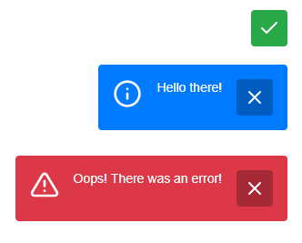

# message.js

A message library to alert the user. Can be especially useful in ajax requests.



## In short

- Vanilla js
- No dependencies
- Small filesize
- Super simple setup

## Usage

In a real life project you may want to put `message.open` inside the final response of an ajax function.

The HTML needed is automatically injected before the end body tag, so no additional HTML is needed.

### CSS

```html
<link rel="stylesheet" href="assets/css/dist/message.min.css">
```

### Javascript

```html
<script src="assets/js/dist/message.min.js"></script>
<script>
let message = new Message();
message.init();

message.open({
  text: 'Error!',
  type: 'error',
  autohide: false,
  openText: true,
});
</script>
```

## Methods

### open

When using this method, you need to send a few params with it.

- `text` - The text message that will be displayed.
- `type` - The "theme" of the message. It can be `error`, `info`, `success` or `warning`.
- `autohide` - If the text message is set to be closed, the box icon will fade away after a time limit.
- `openText` - You can choose to have the text message opened or closed when box is opened.

```js
let message = new Message();

message.open({
  text: 'Hello! This is an error!',
  type: 'error',
  autohide: false,
  openText: true
});
```

**Type `success` defaults**

On a success message, just a check-icon is visible by default and autohides after a time interval. When clicking the icon, you can still see the text message if any.

```js
autohide: true,
openText: false
```

**Type "the rest" defaults**

On all other types the defaults are to show text and not autohide. Instead you close it by clicking the close icon.

## Libraries used

- https://feathericons.com/

## License

MIT

## Donate

Donate to [DevoneraAB](https://www.paypal.me/DevoneraAB) if you want.